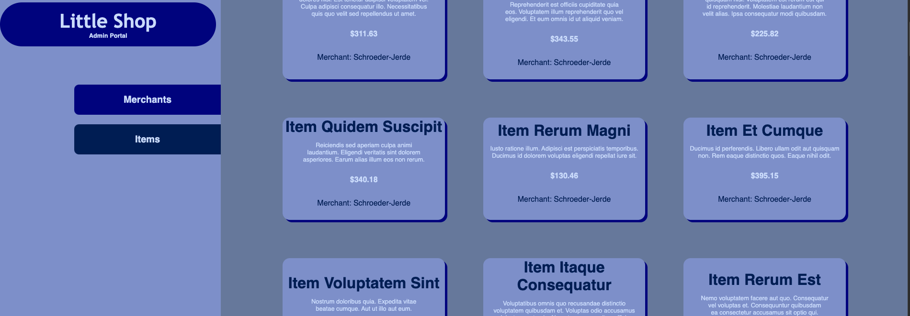

# Hang in There  

### Abstract:
This app allows us to display a variety of merchants and the items they individually carry. It allows us to add items, merchants, as well as items to merchant.

### Installation Instructions:
Installation Instructions:
Clone the repository: git clone <repo-url>
Navigate to the project directory: cd <project-directory>
Install dependencies: npm install
Start the development server: npm start
The app should now be running on http://localhost:3000.

### Preview of App:

### Context:
This project was completed over the course of eight days.

### Contributors:
- [Seth Verrill](https://github.com/sethverrill)
- [Alora Riley](https://github.com/aloraalee)
- [Jose Davalos](https://github.com/jdavalos98)
- [Kaelin Salazar](https://github.com/kaelinpsalazar)

### Learning Goals:
We were trying to work on our CSS abilities and Active Record query methods as thorough as possible. 
All of us were able to partcipate in doing all aspects of the project.

### Wins + Challenges:
We feel really good about how things turned out. Getting the testing to work across our spec tests as well as the required tests in Postman was a big challenge.
If we had more time, our front end layout would be a bit more stylish, but overall we feel like we succeeded given our time constraints.